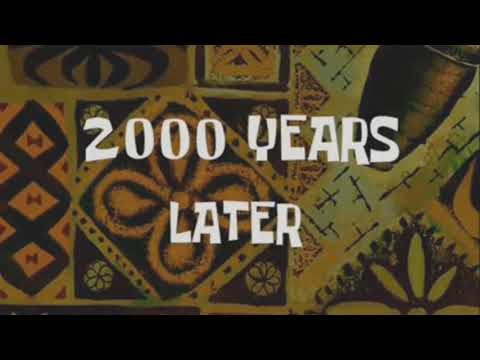
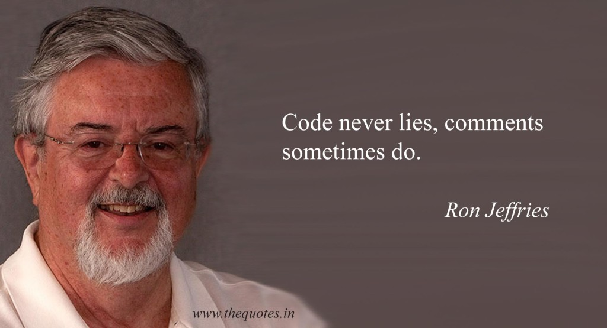

# 1장 깨끗한 코드

## 코드가 존재하리라

코드는 더 이상 문제가 아니라고, 모델이나 요구사항에 집중해야 한다고 생각하는 사람도 있을 것이다.

#### 하지만..!!

앞으로 코드가 사라질 가망은 전혀 없다. 어느 수준에 이르면 코드의 도움 없이 요구사항을 상세하게 표현하기란 불가능하다.

> 궁극적으로 코드는 요구사항을 표현하는 언어라는 사실을 명심해라!
>
> 요구사항에 좀 더 가까운 언어를 만들 수도 있고 요구 사항을 뽑아내는 도구도 만들 수 있다
>
> 하지만 어느 순간, 정밀한 표현이 필요할 때가 온다. 그러므로 코드는 항상 존재하리라

## 나쁜 코드 😒

80년대 후반... 킬러 앱 하나를 구현한 회사가 있었다. 제품은 커다란 인기를 끌었고 수많은 전문가들이 구매해서 사용했다.

#### 하지만....

제품 출시 주기가 점점 늘어 지기 시작했는데... 이전 버전에 있었던 버그가 다음 버전에도 있고 프로그램 시동 시간도 길어지고 프로그램이 죽는 횟수도 늘어났다.

회사는 얼마 못가 망해버렸다.

20여년이 지난 후 그 회사 초창기 직원을 우연히 만나 자초지종을 듣게 되었는데 출시에 바빠 마구잡이로 코드를 짰다는 것이다 기능을 추가 할수록 코드는 엉망이 되어갔고 결국 불가능한 수준에 이르렀다..

그렇다

회사가 망한 원인은 바로 _**나쁜 코드**_ 탓이었다.

우리 모두는 자신이 짠 쓰레 코드를 쳐다보면서 나중에 손보겠다고 생각한 경험이 있다. 우리 모두는 대충 짠 프로그램이 돌아가는 사실에 안도감을 느끼며 안 돌아가는 프로그램보다 쓰레기가 좋다고 스스로를 위로한 경험이 있다. 🙄

다시 돌아와 나중에 정리하겠다고 다짐했었다. 

`하지만 나중은 결코 오지 않는다.`

## 나쁜 코드로 치르는 대가

2~3년 넘게 프로그램을 짰다면 남들이 저질러놓은 쓰레기 코드로 고생한 경험이 있으리라. 나쁜 코드는 개발 속도를 크게 떨어 뜨린다. 매번 얽히고 설킨 코드를 "해독" 해서 얽히고 설킨 코드를 또 더한다. 시간이 지나면서 쓰레기 더미는 점점 높아지고 깊어지고 커진다. 청소할 방법이 없다.

생산성에 0에 근접하면 관리층은 나름대로 복구를 시도한다.

**어떻게???**

인력을 추가로 투입한다. 하지만 새 인력은 시스템 설계에 대한 조예가 깊지 않다. 새 인력과 팀은 생산성을 높여야 한다는 극심한 압력에 시달려 나쁜 코드를 더 많이 양산한다. 🤮🤮🤮

**덕분에 생산성은 0이 된다.**

### **원대한 재설계의 꿈**

팀은 마침내 반기를 든다. `도저히 저 혐오스러운 코드로 일을 하지 못하겠다고`

관리층은 재설계에 자원을 쏟아붓기 싫지만 생산성이 바닥이라는 사실을 부인할 도리가 없다. 결국 팀이 원하는 대로 원대한 재설계를 허락한다.

새로운 타이거 팀이 구성된다.🐱 모두가 타이거 팀에 합류하고 싶어한다. 새로운 프로젝트닌깐..! 하지만 가장 유능하고 똑똑한 사람들만 타이거팀으로 차출된다. 나머지는 계속 현재 시스템을 유지보수한다.

이제 두 팀이 경주를 시작한다. 타이거 팀은 기존 시스템 기능을 모두 제공하는 새 시스템을 내놓아야 한다. 그뿐 만이 아니다. 기존 시스템에 가해지는 변경도 모두 따라잡아야 한다. 

새 시스템이 기존 시스템을 따라잡을 때 즈음이면 초창기 타이거 팀원들은 모두 팀을 떠났고 새로운 팀원들이 새 시스템을 설계하자고 나선다. 

**왜? 현재 시스템이 너무 엉망이라서**

### **태도**

코드가 왜 그렇게 되었을까? 우리는 온 이유를 들이댄다. 

1. 원래 설계를 뒤집는 방향으로 요구사항이 변했다고 불평한다.
2. 일정이 촉박해 제대로 할 시간이 없었다고 한탄한다.
3. 멍청한 관리자와 조급한 고객과 쓸모없는 영업 탓이라 떠벌인다.

**아니요 잘못은 우리 프로그래머에게 있답니다. 우리가 전문가 답지 못했기 때문입니다.**

인정하기 어려우리라. 어째서 _**우리**_  잘못입니까?

**우리가 잘못인 이유**

1. 관리자와 영업은 약속과 공약을 내걸며 **우리에게** 정보를 구한다.
2. 사용자는 요구사항을 내놓으며 **우리에게** 현실성을 자문한다.
3. 프로젝트 관리자는 일정을 잡으며 **우리에게** 도움을 청한다.

우리는 프로젝트를 계획하는 과정에 _깊숙히_ 관여한다.   
그러므로 프로젝트 실패는 우리에게도 커다란 책임이 있다. 특히 나쁜 코드가 초래하는 실패에는 더더더더더욱 책임이 크다.

> 아니 잠깐만요! 상사가 시키는 대로 하지 않으면 짤린다구요!!!

글쎄다. 일정에 쫓기더라도 대다수 관리자는 좋은 코드를 원한다.  
좋은 코드를 사수하는 일은 바로 우리 프로그래머들의 책임이다.

비유를 하나 들어보겠다.  
자신이 의사라고 가정하자. 어느 환자가 수술 전에 손을 씻지 말라고 요구한다.  
시간이 너무 걸리니까.  
확실히 환자는 상사다. 하지만 의사는 단호하게 거부한다.  
왜?  
질병과 감염의 위험은 환자보다 의사가 더 잘 아니까

프로그래머도 마찬가지이다. 나쁜 코드의 위험을 이해하지 못하는 관리자 말을 그대로 따르는 행동은

  
_**전 문 가답지 못하다.**_

### 원초적난제

모든 프로그래머들은 나쁜 코드가 업무 속도를 늦춘다는 사실을 익히안다.  
그럼에도 기한을 맞추려면 나쁜 코드를 양산할 수밖에 없다고 느낀다.  
하지만 기한을 맞추는 유일한 방법은, 빨리 가는 유일한 방법은 바로  
**언제나 코드를 깨끗하게 유지하는 습관이다.**

### **깨끗한 코드란?**

**바야네 스트롭스트룹  
C++ 창시자이자 The C++ Programming Language 의 저자**

> 나는 우아하고 효율적인 코드를 좋아한다.  
> 논리가 간단해야 버그가 숨어들지 못한다.  
> 의존성을 최대한 줄여야 유지보수가 쉬워진다.  
> 오류는 명백한 전략에 의거해 철저히 처리한다.  
> 성능을 최적으로 유지해야 사람들이 원칙 없는 최적화로  
> 코드를 망치려는 유혹에 빠지지 않는다.  
> 깨끗한 코드는 한 가지를 제대로 한다.

  
****바야네에 따르면 깨끗한 코드는 "**보기에 즐거운**" 코드이다.  
그리고 나쁜 코드는 나쁜 코드를 "**유혹**" 한다.  
또한 깨끗한 코드는 세세한 사항까지 꼼꼼하게 처리하는 코드다.  
마지막으로 깨끗한 코드는 한가지에 "**집중**"한다. 

  
 **** 

**그래디 부치  
Object Oriented Analysis and Design with Application 저자**

> 깨끗한 코드는 단순하고 직접적이다.  
> 깨끗한 코드는 잘 쓴 문장처럼 읽힌다.  
> 깨끗한 코드는 결코 설계자의 의도를 숨기지 않는다.  
> 오히려 명쾌한 추상화와 단순한 제어문으로 가득하다.

**"가독성"**이 좋아야한다.  
코드는 "**추측이 아니라 사실"**에 기반해야 한다.  
"**반드시 필요"**한 내용만 담아야한다.

**데이브 토마스  
OTI 창립자이자 이클립스 전략의 대부**

> 깨끗한 코드는 작성자가 아닌 사람도 읽기 쉽고 고치기 쉽다.  
> 단위 테스트 케이스와 인수 테스트 케이스가 존재한다.  
> 깨끗한 코드에는 의미 있는 이름이 붙는다.  
> 특정 목적을 달성하는 방법은 하나만 제공한다.  
> 의존성은 최소이며 각 의존성을 명확히 정의한다.  
> API 는 명확하며 최소로 줄였다.  
> 언어에 따라 필요한 모든 정보를 코드만으로 명확히 표현할 수 없기에  
> 코드는 문학적으로 표현해야 마땅하다

깨끗한 코드란 **다른 사람이 "고치기 쉽다"**  
"**테스트 케이스"**가 없는 코드는 깨끗한 코드가 아니다.  
코드는 "**작을수록 좋다"**  
인간이 "**읽기 좋은 코드"**를 작성해라

**마이클 페더스  
Working Effectively with Legacy Code 저자**

> 깨끗한 코드의 특징은 많지만 그 중에서도 모두를 아우르는 특징이 하나있다.  
> 깨끗한 코드는 언제나 누군가 주의 깊게 짰다는 느낌을 준다.  
> 고치려고 살펴봐도 딱히 손 댈 곳이 없다.  
> 작성자가 이미 모든 사항을 고려했으므로, 고칠 궁리를 하다보면  
> 언제나 제자리로 돌아온다.  
> 그리고 누군가 남겨준 코드, 누군가 주의깊게 짜놓은 작품에 감사를 느낀다.

깨끗한 코드는 "**주의 깊게"** 작성한 코드다.

**론 제프리스  
Extreme Programming Installed, Extreme Programming Adventure in C\# 저자**

> 간단한 코드  
> 1. 모든 테스트를 통과한다.  
> 2. 중복이 없다.  
> 3. 시스템 내 모든 설계 아이디어를 표현한다.  
> 4. 클래스, 메서드, 함수 등을 최대한 줄인다.  
>   
> 물론 나는 주로 중복에 집중한다. 같은 작업을 여러 차례 반복한다는 것은   
> 코드가 아이디어를 제대로 표현하지 못한다는 증거다.  
>   
> 그리고 의미 있는 이름을 표현력이라고 생각한다.  
> 또, 여러 기능을 수행하는 객체나 메서드를 찾는다.  
> 객체와 메서드가 여러 기능을 수행한다면 여러 객체와 여러 메서드로 나눈다.  
>   
> 오랜 경험 끝에 나는 모든 프로그램이 아주 유사한 요소로 이뤄진다는 사실을 깨달았다.  
> 프로그램을 짜다보면 어떤 집합에서 특정 항목을 찾아낼 필요가 자주 생긴다.  
> 이런 상황이 발생하면 나는 추상 메서드나 추상 클래스를 만들어 실제 구현을 감싼다.  
>   
> **중복 줄이기, 표현력 높이기, 초반부터 간단한 추상화 고려**하기  
> 깨끗한 코드를 만드는 비결이다.

**중복 피하기, 한 가지 기능만 수행하기, 제대로 표현해라, 작게 추상화하라   
이 책의 내용을 요약했다. 끝**

## **우리들 생각**

이 책은 **오브젝트 멘토 진영**이 생각하는 깨끗한 코드를 설명한다.  
실제로도 이 책에서 주장하는 기법 다수는 논쟁의 여지가 있다. 여러분도 모든 기법에 동의하지 않으리라  
그래도 괜찮다.  
  
우리 생각이 무조건 옳다고 주장할 의도는 없으니까.  
하지만 수십 년에 걸친 경험과 반복적인 시행착오로 습득한 교훈과 기법이다.  
그러므로 여러분이 동의하든 안하든 우리 시각을 이해하고 존중해줬으면 좋겠다.

## 우리는 저자다.

@author 필드는 저자를 소개한다. 그렇다 **우리는 저자다.**   
저자에게는 독자와 **잘 소통할 책임**이 있다.  
여러분의 노력을 보고 판단을 내릴 독자가 있다는 사실을 기억하길 바란다.  
  
혹시 편집 세션을 재생해본 경험이 있는가?  
한 시간동안 열심히 작업한 후 편집 세션을 재생하면 한 편의 고속 영화가 펼처진다.  
결과는 놀랍게도   
대부분 화면을 스크롤하거나 다른 모듈을 찾아보는 동작이었다!  
  
그렇다. 우리는 새 코드를 짜면서 **끊임없이** 기존 코드를 읽는다.  
그래서 읽기 쉬운 코드가 매우 중요하다는 것이다.

## 보이스카우트 규칙

잘 짠 코드가 전부가 아니다. 시간이 지나도 언제나 깨끗하게 유지해야 한다.  
미국 보이스카우트가 따르는 간단한 규칙에 따르면  

> 캠프장은 처음 왔을 때보다 더 깨끗하게 해놓고 떠나라

**시간이 지날수록 코드가 좋아**지는 프로젝트에서 작업한다고 상상해보라!  
지속적인 개선이야말로 전문가 정신의 본질이다.

## 결론

예술에 대한 책을 읽는다고 예술가가 된다는 보장은 없다  
이 책도 마찬가지이다.  
이 책을 읽는다고 뛰어난 프로그래머가 된다는 보장은 없다.  
단지 프로그래머가 생각하는 방식과 그들이 사용하는 기술과 기교와 도구를 소개할 뿐이다.  
  
이 책 역시 세세한 정보로 가득하다.  
좋은 코드, 나쁜 코드 둘 다 소개한다.  
나쁜 코드를 좋은 코드로 바꾸는 방법도 소개한다.  
그리고 다양한 경험적 교훈과 체계, 절차와 기법도 보여준다.  
예제도 무수히 많다.

  
**나머지는 여러분에게 달렸다.**

