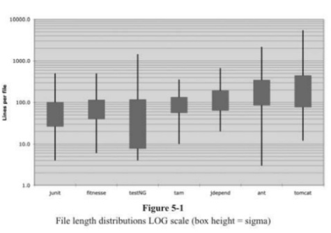
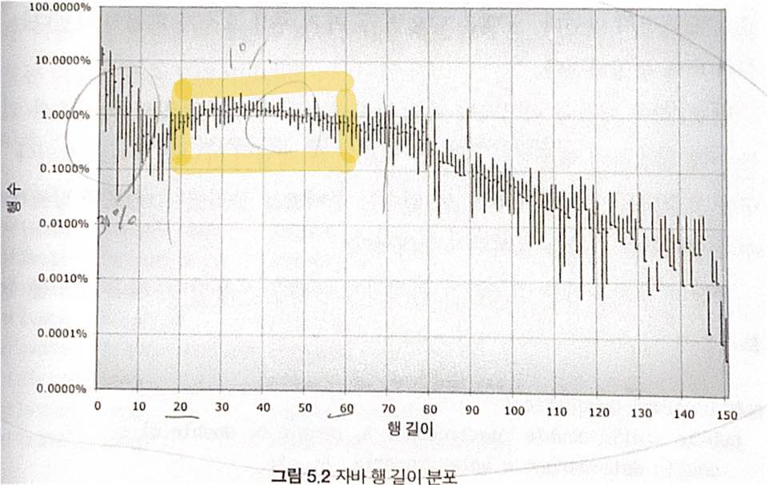

# 5장 형식 맞추기

### 시작

프로그래머라면 형식을 깔끔하게 맞춰 코드를 짜야 한다. 코드 형식을 맞추기 위한 간단한 규칙을 정하고  
그 규칙을 착실히 따라야한다.   
팀으로 일한다면 팀이 합의해 **규칙을 정하고 모두가 그 규칙을 따라야** 한다.

### 형식을 맞추는 목적 

**코드 형식은 중요하다**!   
너무 중요해서 무시하기 어렵다.  
코드 형식은 의사소통의 일환이다. 

어쩌면 `돌아가는 코드` 가 전문 개발자의 일차적인 의무라 여길지도 모르겠다  
하지만 이 책을 읽으면서 생각이 바뀌었기 바란다.  
오늘 구현한 기능이 다음 버전에서 바뀔 확률은 아주 높다.   
**그런데**  
오늘 구현한 코드의 가독성은 **앞으로 바뀔 코드의 품질에 지대한 영향**을 미친다.  
원래 코드는 사라질지라도 **개발자의 스타일과 규율을 사라지지 않는다**.

그렇다면 원활한 소통을 장려하는 코드 형식은 무엇일까?

### 적절한 행 길이를 유지하라

세로 길이부터 살펴보자. 소스 코드는 얼마나 길어야 적당할까?



 JUnit, FitNeese, testNG, Time and Money\(tam\), JDepend, Ant, Tomcat 프로젝트를 조사한 결과다.  
상자를 관통하는 선은 각 프로젝트에서 최대 파일 길이와 최소 파일 길이를 나타낸다.   
상자는 대략 파일의 1/3 을 차지한다.  
상자 중간이 평균이다.

* FitNeese

  * 평균 파일 크기는 약 65줄 이다.
  * 전체 파일 중 대락 1/3 이 40줄에서 100줄 조금 넘는 정도
  * 가장 긴 파일 400줄
  * 가장 짧은 파일은 6줄

JUnit, FitNeese, Time and Money 는 상대적으로 파일 크기가 작다.   
500줄을 넘어가는 파일이 없으며 대다수가 200줄 미만이다.

반면, Tomcat 과 Ant 는 절반이상이 200줄을 넘어서고 심지어 수천 줄이 넘어가는 파일도 있다.

위 표가 우리에게 말하는 것은 500줄을 넘지 않고 **대부분 200줄 정도인 파일로도 커다란 시스템을 구축**할 수 있다는 사실이다.

일반적으로 큰 파일보다 작은 파일이 이해하기 쉽다.

### 신문 기사처럼 작성하라

소스 파일도 신문기사와 비슷하게 작성한다.  
이름만 보고도 올바른 모듈을 살펴보고 있는지 아닌지를 판단 할 정도로 신경써서 짓는다.

### 개념을 빈 행으로 분리해라

빈 행은 새로운 개념을 시작한다는 시각적 단서다. 

```java
pacakge fitnesse.wikitext,widgets;

import java.util.regex.*;

public class BoldWidget extends ParentWidget {
    public static final String RegEXP = "'''.+?'''";
    ...
}

public BoldWidget(ParentWidget parent, String text) throws Exception {
    super(parent);
    ...
}
```

### 세로 밀집도

줄바꿈이 개념을 분리한다면 세로 밀집도는 연관성을 의미한다.   
즉, **서로 밀접한 코드 행은 세로로 가까이** 놓여야 한다는 뜻이다.

```java
public class ReporterConfig {
    /**
    *  리포터 리스너의 클래스 이름
    */
    private String m_className;
    
    /**
    *  리포터 리스너의 속성 
    */
    private List<Property> m_properties = new ArrayList<Property>();
    ...
    
    
    ================================================================
public class ReporterConfig {
    private String m_className;
    private List<Property> m_properties = new ArrayList<Property>();
...
```

### 수직거리

함수 연관 관계와 동작 방식을 이해하려고 이 함수에서 저 함수로 오가며 소스 파일을 위아래로 뒤지는 등 뺑뺑이를 돌았으나 결국은 미로 같은 코드 때문에 혼란만 가중된 경험이 있는가?

시스템이 무엇을 하는 지 이해하고 싶은데, 이 조각 저 조각 **어디에 있는지 찾고 기억**하느라 시간과 노력을 소모한다.

**서로 밀접한 개념은 세로로 가까이** 둬야 한다. 이게 바로 protected 변수를 피해야 하는 이유 중 하나다   
\( protected 변수는 상속 받은 외부 패키지에서 접근할 수 있는 변수라서 변수가 다른 데 정의 될 수 있기 때문 \)

1. **변수 선언**
   1. 변수를 사용하는 위치에 최대한 가까이 선언한다.
      1. 지역 변수는 각 함수 맨 처음에 선언
      2. 루프를 제어하는 변수는 루프 문 내에 선
      3. 가끔 루프 직전에 변수를 선언하는 경우도 있음
2. **인스턴스 변수**
   1. 인스턴스 변수는 클래스 맨 처음에 선언한다. 변수 간에 세로로 거리를 두지 않는다.
3. **종속 함수**
   1. 한 함수가 다른 함수를 호출한다면 두 함수는 세로로 가까이 배치
   2. 호출하는 함수를 호출되는 함수보다 먼저 배치한다. \(그러면 프로그램이 자연스럽게 읽힌다.\)
4. **개념적 유사성**
   1. 어떤 코드는 서로 끌어당긴다.
   2. 개념적인 친화도가 높기 때문
   3. 친화도가 높을 수록 코드를 가까이 배치한다.

```java
public class Assert {
    static public void assertTrue(String message, boolean condition) {
        if (!condition) {
            fail(message);
        }
    }
    
    static public void assertTrue(boolean condition) {
        assertTrue(null, condition);
    }
    
    static public void assertFalse(String message, boolean condition) {
        assertTrue(message, !condition);
    }
    
    static public void assertFalse(boolean condition) {
        assertFalse(null, condition);
    }
}
```

위 함수들은 개념적인 친화도가 매우 높다. 명명법이 똑같고 기본 기능이 유사하고 간단하다.

### 세로 순서

일반적으로 함수 호출 종속성은 아래방향으로 유지한다.  
다시 말해, 호출되는 함수를 호출하는 함수보다 나중에 배치한다.   
그러면 소스코드 모듈이 고차원에서 저차원으로 자연스럽게 내려간다.

### 가로 형식 맞추기



20 ~ 60자 사이인 행이 총 행 수의 40%에 달한다.  
10자 미만은 30%정도로 보인다.  
80자 이후부터 행 수는 급격하게 감소한다.

요즘에는 모니터가 커서 글꼴 크기를 왕창 줄여 200자까지도 한 화면에 들어갈 수 있지만  
**120자 정도**로 행 길이를 제한한다.

### 가로 공백과 밀집도

가로로는 공백을 사용해 밀접한 개념과 느슨한 개념을 표현한다.

```java
private void measureLine(String line) {
    lineCount++;
    int lineSize = line.length(); // 왼쪽과 오른쪽 요소가 분명히 나뉜다.
    totalChars += lineSize;
    lineWidthHistogram.addLine(lineSize, lineCount); // 인수들 사이는 별개다.
    recordWidestLine(lineSize); // 함수와 인수는 밀접하다.
}
```

### 가로 정렬

```java
public class FitNesseExpediter implements ResponseSender {
    private     Socket         socket;
    private     InputStream    input;
    private     OutputStream   output;
    private     Reques         request;      
    private     Response       response; 
    private     FitNesseContex context; 
    protected   long           requestParsingTimeLimit;
    private     long           requestProgress;
    private     long           requestParsingDeadline;
    private     boolean        hasError;

	public FitNesseExpediter(Socket          s,
							 FitNesseContext context) throws Exception
	{
		this.context =            context;
		socket =                  s;
		input =                   s.getInputStream();
		output =                  s.getOutputStream();
		requestParsingTimeLimit = 10000;
	}
```

사실 위와 같은 정렬이 별로 유용하지 못하다.

1. 변수 유형은 무시하고 변수 이름부터 읽게된다.
2. 할당 연산자는 보이지 않고 오른쪽 피연산자에 눈이 간다.
3. 어차피 코드 형식 맞춰주는 도구들은 위와 같은 정렬을 무시한다.

```java
public class FitNesseExpediter implements ResponseSender {
    private Socket socket;
    private InputStream input;
    private OutputStream output;
    private Request request;      
    private Response response; 
    private FitNesseContex context; 
    protected long requestParsingTimeLimit;
    private long requestProgress;
    private long requestParsingDeadline;
    private boolean hasError;

	public FitNesseExpediter(Socket s,
		FitNesseContext context) throws Exception {
		this.context = context;
		socket = s;
		input = s.getInputStream();
		output = s.getOutputStream();
		requestParsingTimeLimit = 10000;
	}
```

### 들여쓰기

소스 파일은 윤곽도\(outline\)와 계층이 비슷하다.

범위로 이뤄진 계층을 표현하기 위해 우리는 **코드를 들여쓴다.**  
들여쓰는 정도는 계층에서 코드가 자리잡은 수준에 비례한다.

* 클래스 정의처럼 파일 수준인 문장은 들여쓰지 않음
* 클래스 내 메서드는 클래스보다 한 수준 들여쓴다.
* 메서드 코드는 메서드 선언보다 한 수준 들여쓴다.
* 블로코드는 블록을 포함하는 코드보다 한 수준 들여쓴다.

1. **들여쓰기 무시하기**

   1. 때로는 간단한 if문, 짧은 while문, 짧은 함수에서 들여쓰기를 무시하고픈 유혹이 생긴다.

   ```java
   public class CommentWidget extends TextWidget {
       public static final String REGEXP = "^#[^\r\n]*(?:(?:\r\n)|\n|\r)?";

       public CommentWidget(ParentWidget parent, String text) {super(parent, text);}
       public String render() throws Exception {return ""; } 
   }

   ================================================================================

   public class CommentWidget extends TextWidget {
       public static final String REGEXP = "^#[^\r\n]*(?:(?:\r\n)|\n|\r)?";

       public CommentWidget(ParentWidget parent, String text) {
           super(parent, text);
       }
    
       public String render() throws Exception {
           return ""; 
       } 
   }

   ```

2. **가짜 범위**

때로는 빈 while 문이나 for 문을 접한다.  
만약 쓰게 된다면 세미콜론\(;\)을 새 행에다 제대로 들여써서 넣어준다.

```java
while (dis.read(buf, 0, readBufferSize) != -1)
;
```

### 팀 규칙

팀에 속한다면 자신이 선호해야 할 규칙은 바로 팀 규칙이다.  
개개인이 따로국밥처럼 맘대로 짜대는 코드는 피해야 한다.


좋은 소프트웨어 시스템은 읽기 쉬운 문서로 이뤄진다는 사실을 기억하기 바란다.  
스타일은 일관적이고 매끄러워야 한다.  
한 소스 파일에서 봤던 형식이 다른 소스 파일에도 쓰이리라는 신뢰감을 독자에게 줘야 한다.

