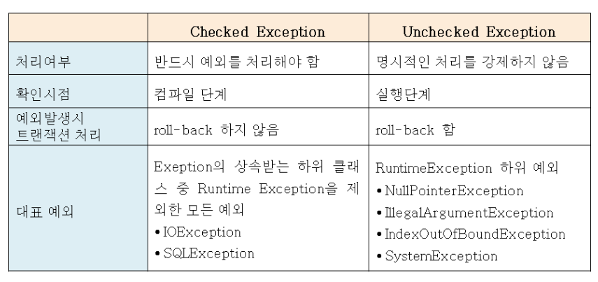

# 7장 오류 처리

> 오류 처리는 프로그램에서 반드시 필요한 요소 중 하나일 뿐이다
>
> 간단히 말해, 뭔가 잘못될 가능성은 늘 존재한다.
>
> 뭔가 잘못되면 바로잡을 책임은 바로 _우리 프로그래머에게_ 있다.

## 오류 코드보다 예외를 사용하라

```java
public class DeviceController {
...
public void sendShutDown() {
  DeviceHandle handle = getHandle(DEV1);
  // 디바이스 상태를 점검한다.
  if (handle != DeviceHandle.INVALID) {
    // 레코드 필드에 디바이스 상태를 저장한다.
    retrieveDeviceRecord(handle);
    // 디바이스가 일시정지 상태가 아니라면 종료한다. 
    if (record.getStatus() != DEVICE_SUSPENDED) {
      pauseDevice(handle);
      clearDeviceWorkQueue(handle);
      closeDevice(handle);
    } else {
      logger.log("Device suspended. Unable to shut down");
    }
  } else {
    logger.log("Invalid handle for: " + DEV1.toString());
  }
}
...
}
```

* 호출자 코드가 복잡해진다.
* 함수를 호출한 즉시 오류를 확인해야 한다.

```java
public class DeviceController {
...
public void sendShutDown() {
  try {
    tryToShutDown();
  } catch (DeviceShutDownError e) {
    logger.log(e);
  }
}

private void tryToShutDown() throws DeviceShutDownError {
  DeviceHandle handle = getHandle(DEV1);
  DeviceRecord record = retrieveDeviceRecord(handle);
  pauseDevice(handle);
  clearDeviceWorkQueue(handle);
  closeDevice(handle);
}

private DeviceHandle getHandle(DeviceID id) {
  ...
  throw new DeviceShutDownError("Invalid handle for: " + id.toString());
  ...
}
...
}
```

* 오류가 발생하면 예외를 던지자
* 논리가 오류 처리 코드와 뒤섞이지 않는다.

## Try-Catch-Finally 문부터 작성하라 

예외에서 _**프로그램 안에다**_ 범위를 정의한다는 사실은 매우 흥미롭다.  
어떤 면에서 try 블록은 트랜잭션과 비슷하다.  
예외가 발생할 코드를 짤 때는 try-catch-finally 문으로 시작하는 편이 낫다.

### 예외를 던지지 않는 코

```java
@Test(expected = StorageException.class)
public void retrieveSectionShouldThrowOnInvalidFileName() {
  sectionStore.retrieveSection("invalid - file");
}

public List<RecordedGrip> retrieveSection(String sectionName) {
  // 실제로 구현할 때까지 비어 있는 더미를 반환한다.
  return new ArrayList<RecordedGrip>(); // 예외를 던지지 않고 있어서 단위테스트는 실
}
```

### 예외 코드를 던지는 코드

```java
public List<RecordedGrip> retrieveSection(String sectionName){
  try{
    FileInputStream stream = new FileInputStream(sectionName);
  } catch (Exception e) {
    throw new StorageException("retrieval error", e); // 예외를 던지고 있다.
  }
  return new ArrayList<RecordedGrip>();
}
```

### 예외 유형을 좁힌 코드

```java
public List<RecordedGrip> retrieveSection(String sectionName) {
  try {
    FileInputStream stream = new FileInputStream(sectionName);
    stream.close();
  } catch (FileNotFoundException e) { // 특정 예외를 잡아낸다.
    throw new StorageException("retrieval error", e);
  }
  return new ArrayList<RecordedGrip>();
}
```

#### 테스트 케이스 작성 꿀팁★

* 먼저 강제로 예외를 일으키는 테스트 케이스를 작성한 후 테스트를 통과하게 코드를 작성한다.
* 그러면 자연스럽게 try 블록의 트랜잭션 범위부터 구현하게 되므로 트랜잭션 본질을 유지하기 쉽다.

## 미확인 예외를 사용하라

여러 해 동안 자바 프로그래머들은 확인된\(checked\) 예외의 장단점을 놓고 논쟁을 벌여왔다.  
메서드를 선언할 때는 메서드가 반환할 예외를 모두 열거했다.  
게다가 메서드가 반환하는 예외는 메서드 유형의 일부였다. 

지금은 C\#, C++, 파이썬, 루비 모두 확인된 예외를 지원하지 않는다.

왜냐하면, 확인된 예외는 **OCP 를 위반**하기 때문이다!



OCP 를 위반한다는 점은

1. 메서드에서 확인된 예외를 던졌는데 catch 블록이 세단계 위에 있다면 그 사이 메서드 모두가 선언부에 해당 예외를 정의해야 한다.
2. 하위 단계에서 코드를 변경하면 상위 단계 메서드 선언부를 전부 고쳐야 한다.
3. 만약에 메서드 안에 메서드를 호출하고 또 메서드를 호출하고 있다.
4. 근데 최하위 메서드에서 변경이 일어나 새로운 오류를 던진다고 가정해보자
5. 변경된 함수를 호출하는 모든 함수가 catch 블록에 새로운 예외를 처리하거나
6. 선언부에 throw 절을 추가해야 한다.
7. 최상외 단계까지 연쇄적인 수정이 일어난다!

#### Checked Exception 종류

* `SQLException`
* `IOException`
* `ClassNotFoundException`
* `InvocationTargetException`

#### 출처 : [https://beginnersbook.com/2013/04/java-checked-unchecked-exceptions-with-examples/](https://beginnersbook.com/2013/04/java-checked-unchecked-exceptions-with-examples/)

```java
import java.io.*;
class Example {  
   public static void main(String args[]) 
   {
	FileInputStream fis = null;
	/*This constructor FileInputStream(File filename)
	 * throws FileNotFoundException which is a checked
	 * exception
   */
  fis = new FileInputStream("B:/myfile.txt"); 
	int k; 

	/* Method read() of FileInputStream class also throws 
	 * a checked exception: IOException
   */
	while(( k = fis.read() ) != -1) 
	{ 
		System.out.print((char)k); 
	} 

	/*The method close() closes the file input stream
	 * It throws IOException*/
	fis.close(); 	
   }
}
```

```java
import java.io.*;
class Example {  
   public static void main(String args[]) throws IOException // 여기서 예외 처
   {
      FileInputStream fis = null;
      fis = new FileInputStream("B:/myfile.txt"); 
      int k; 

      while(( k = fis.read() ) != -1) 
      { 
	   System.out.print((char)k); 
      } 
      fis.close(); 	
   }
}

----------------------------------------------------------------

import java.io.*;
class Example {  
   public static void main(String args[]) {
	 FileInputStream fis = null;
	
	 try{ // 아니면 try catch 로 잡아야 한다.
	     fis = new FileInputStream("B:/myfile.txt"); 
	 }catch(FileNotFoundException fnfe){
  			System.out.println("The specified file is not "+"present at the given path");
	 }
	
	 int k; 
	
	 try{
	      while(( k = fis.read() ) != -1) 
	      { 
		      System.out.print((char)k); 
	      } 
	      fis.close(); 
	 }catch(IOException ioe){
	    System.out.println("I/O error occurred: "+ioe);
	 }
  }
}
```

#### UnChecked Exception 종류

*  **RuntimeException**  의 서브 클래스 모두 다!

### 예외에 의미를 제공하라

오류가 발생한 원인과 위치를 찾기 쉽게 전후 상황을 충분히 덧붙인다.  
오류 메시지에 정보를 담아 예외와 함께 던진다.

### 호출자를 고려해 예외 클래스를 정의하라

애플리케이션에서 오류를 정의할 때 프로그래머에게 가장 중요한 관심사는 **오류를 잡아내는 방법**이다.

#### 형편없는 사

```java
ACMEPort port = new ACMEPort(12);
try {
  port.open();
} catch (DeviceResponseException e) {
  reportPortError(e);
  logger.log("Device response exception", e);
} catch (ATM1212UnlockedException e) {
  reportPortError(e);
  logger.log("Unlock exception", e);
} catch (GMXError e) {
  reportPortError(e);
  logger.log("Device response exception");
} finally {
  ...
}
```

* 외부 라이브러리르 호출하는 코드
* 외부 라이브러리가 던질 예외를 모두 잡아낸다.

```java
LocalPort port = new LocalPort(12);
try {
  port.open();
} catch (PortDeviceFailure e) {
  reportError(e);
  logger.log(e.getMessage(), e);
} finally {
  ...
}

-----------------------------------------------------------------
public class LocalPort {
  private ACMEPort innerPort;
  public LocalPort(int portNumber) {
    innerPort = new ACMEPort(portNumber);
  }

  public void open() {
    try {
      innerPort.open();
    } catch (DeviceResponseException e) {
      throw new PortDeviceFailure(e);
    } catch (ATM1212UnlockedException e) {
      throw new PortDeviceFailure(e);
    } catch (GMXError e) {
      throw new PortDeviceFailure(e);
    }
  }
  ...
}
```

* 예외에 대응하는 방식이 거의 동일해서 예외 유형 하나를 반환하는 식으로 변경한다.
* LocalPort 는 ACMEPort 가 던지는 예외를 잡기 쉽도록 만든 Wrapper 클래스 이다.
* 외부 API 를 한번 감싸면 외부 라이브러리와 프로그램 사이에서 의존성이 크게 줄어든다.
* 그리고 특정 업체가 API 를 설계한 방식에 발목잡히지 않는다.

### 정상 흐름을 정의하라 

위와 같은 방식이 대개는 멋진 처리 방식이지만 때로는 중단이 적합하지 않을 때도 있다.

#### 안좋은 

```java
try { 
  MealExpenses expenses = expenseReportDAO.getMeals(employee.getID());
  m_total += expenses.getTotal(); 
} catch(MealExpensesNotFound e) {
   m_total += getMealPerDiem(); 
}
```

* 비용 청구 애플리케이션에서 총계를 계산하는 허술한 코드다.
* 식비를 비용으로 청구했다면 직원이 청구한 식비를 총계에 더한다.
* 식비를 비용으로 청구하지않았다면 일일 기본 식비를 총계에 더한다.

#### 좋은 

```java
MealExpenses expenses = expenseReportDAO.getMeals(employee.getID());
m_total += expenses.getTotal();

public class PerDiemMealExpenses implements MealExpenses {
  public int getTotal() {
    // 기본값으로 일일 기본 식비를 반환
  }
}
```

* 특수 상황을 처리할 필요가 없다면 더 간결하게 짤 수 있다.
* expenseReportDAO 가 항상 MealExpense 객체를 반환하게 한다.
* 이를 특수 사례 패턴 SPECIAL CASE PATTERN 라고 한다.
* 클래스를 만들거나 객체를 조작해 특수 사례를 처리하는 방법이다. 
* 캡슐화해서 예외 처리를 하는 방법이다.

### NULL 을 반환하지 마라

#### 안 좋은 예 1

```java
public void registerItem(Item item) { 
  if (item != null) {
    ItemRegistry registry = peristentStore.getItemRegistry();
    if (registry != null) {
      Item existing = registry.getItem(item.getID());
      if (existing.getBillingPeriod().hasRetailOwner()) {
        existing.register(item);
      }
    }
  }
}
```

* persistentStore 가 null 체크를 하지 않았다.
* null 확인이 너무 너무 많아 진다.

#### 안 좋은 예2

```java
List<Employee> employees = getEmployees(); // getEmployees 는 null 을 반환
if (employees != null) {
  for(Employee e : employees) {
    totalPay += e.getPay();
  }
}

------------------------------------------------------------
  
List<Employee> employees = getEmployees(); // getEmployees 가 emptyList 를 반환하
for(Employee e : employees) {
    totalPay += e.getPay();
  }

public List<Employee> getEmployees() {
   if( .. 직원이 없다 .. )
     return Collections.emptyList(); // 빈 list 를 반환하자
   }
}
```

### NULL 을 전달하지 마라

메서드로  NULL 을 전달하는 방식은 더 나쁘다!

```java
public class MetricsCalculator { 
  public double xProjection(Point p1, Point p2) { 
    return (p2.x – p1.x) * 1.5; 
  } 
  ...
}
```

* 누군가 인수로 null 을 전달하면 어떻게 될까? 🥕🏏 NullPointerException

```java
public class MetricsCalculator { 
  public double xProjection(Point p1, Point p2) { 
    if(p1 == null || p2 == null){
      throw InvalidArgumentException("Invalid argument for MetricsCalculator.xProjection"); 
    } 
    return (p2.x – p1.x) * 1.5; 
  } 
}
```

* 예외 유형을 던지는 방법이 있다
* 하지만 예외를 잡아내는 처리기가 필요하다 

```java
public class MetricsCalculator { 
  public double xProjection(Point p1, Point p2) { 
    assert p1 != null : "p1 should not be null";
    assert p2 != null : "p2 should not be null";
    return (p2.x – p1.x) * 1.5; 
  } 
}
```

* assert 문을 사용하자 
* 하지만 여전히 null 을 전달하면 오류 발생!

## 결론

> 오류 처리를 프로그램 논리와 분리해 독자적인 사안으로 고려하면 튼튼하고 깨끗한 코드를 작성할 수 있다.
>
> 독립적인 추론이 가능해지며 코드 유지 보수성도 크게 높아진다

