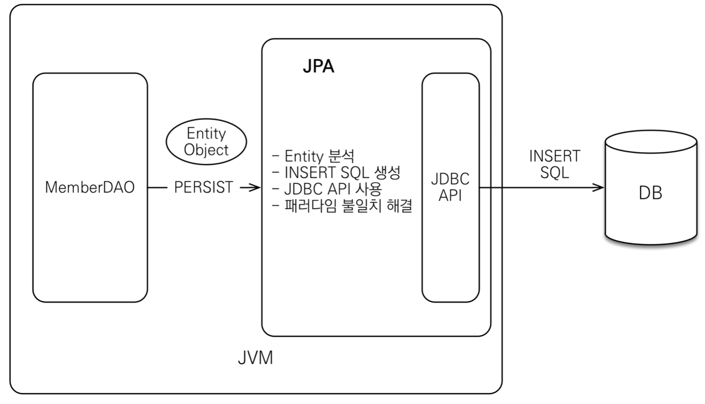
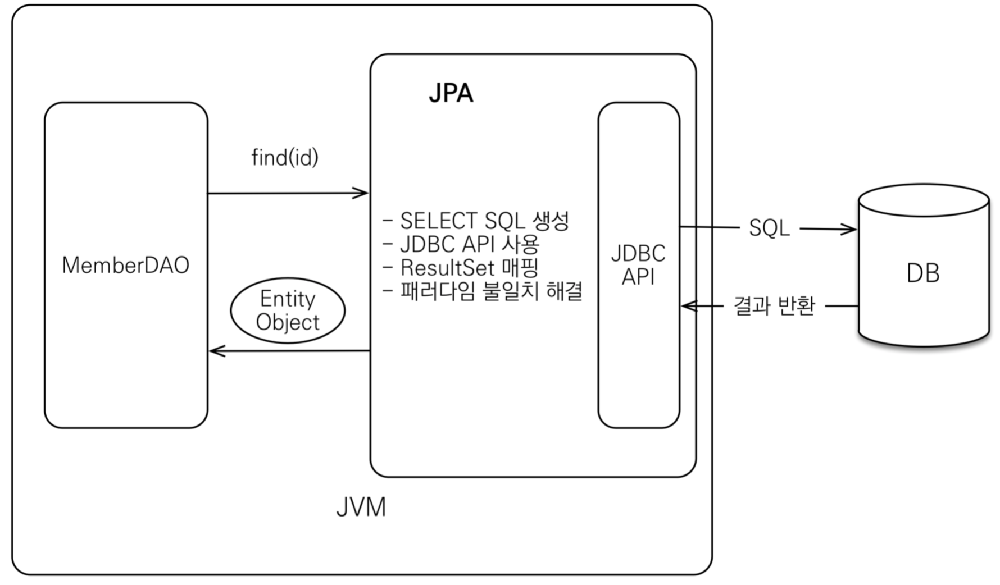

# 1장 JPA 소개

## JPA 란?

* 자바 진영의 ORM\(Object-Relational Mapping\) 기술 표준
* CRUD SQL 을 알아서 처리
* 객체 모델링과 관계형 데이터베이스 사이의 차이점도 해결
* 실행 시점에 자동으로 SQL을 만들어서 실행
  * 개발자는 SQL 을 직접 작성하는 것이 아니라 어떤 SQL 이 실행될지 생각만 하면 됨

## JPA 의 장점

* 애플리케이션을 SQL 이 아닌 객체 중심으로 개발
* 생산성과 유지보수 확연히 좋아짐
* 테스트 작성하기도 편리
* 버그도 많이 줄어

## SQL 을 직접 다룰 때 발생하는 문제점

### 반복, 반복 그리고 반복

회원을 CRUD 하는 기능을 개발해보자

1. 회원 객체를 만든다. `public class Member`
2. 회원용 DAO 를 만든다.  `public class MemberDAO`
   1. DAO 에서 사용하는 find 메소드를 구현하자 `public Member find(String memberId)`
   2. 회원 조회용 SQL 을 작성한다. `SELECT MEMBER_ID, NAME FROM MEMBER M WHERE MEMBER_ID = ?`
   3. JDBC API 를 사용해서 SQL 을 실행한다. `ResultSet rs = stmt.executeQuery(sql);`
   4. 조회 결과를 Member 객체로 매핑한다. `String memberId = rs.getString("MEMBER_ID");`

회원 조회 기능을 완성했다. 다음으로 회원 등록 기능을 만들어보자

1. 회원 등록용 SQL 를 작성한다. `String sql = "INSERT INTO MEMBER(MEMBER_ID, NAME) VALUES (?,?)";`
2. 회원 객체의 값을 꺼내서 등록 SQL 에 전달한다. `pstmt.setString(1, member.getMemberId());`
3. JDBC API 를 사용해서 SQL 을 실행한다. `pstmt.executeUpdate(sql);`

다음으로 회원을 수정하고 삭제하는 기능을 추가해보자.

아마도 **SQL 을 작성하고 JDBC API 를 사용하는** 비슷한 일을 반복해야 할 것이다.  
테이블 마다 이런 비슷한 일을 반복해야 하는데, 개발하려는 애플리케이션에서 사용하는 데이터베이스 테이블이 100개라면 무수히 많은 SQL 을 작성해야 되고 이런 비슷한 일을 100번 더 반복해야 한다.

### SQL 에 의존적인 개발

앞에서 만든 회원 객체를 관리하는 MemberDAO 를 완성하고 나머지 기능도 개발을 완료했다.

**그런데 갑자기**

회원의 연락처도 함께 저장해달라는 요구 사항이 추가 되었다.

#### 등록 코드 변경 

1. Member 클래스에 `TEL` 필드 추가 및 회원테이블에 `TEL` 컬럼 추가 
2. 연락처를 저장할 수 있도록 INSERT SQL 도 수정
3. 회원 객체의 연락처 값을 꺼내서 등록 SQL 에 전달 `pstmt.setString(3, member.getTel());`

#### 조회 코드 변경

1. 회원 조회용 SQL 수정
2. 조회 결과를 Member 객체에 추가로 맵핑

#### 수정 코드 변경

1. 회원 수정용 SQL 수정
2. `MemberDAO.update()` 코드 수정해서 연락처도 업데이트 

#### 연관된 객체 추가

1. Member 객체 team 이라는 Team 클래스가 추가됨 `private Team team`
2. MemberDAO 에 `public Member findWithTeam(String memberId)` 이라는 새로운 메소드가 추가
3. findWithTeam 에 맞는 SQL 작성

자, 문제점을 정리해보자.

> Member 객체가 연관된 Team 객체를 사용할 수 있을 지 없을 지는 전적으로 SQL 에 달려 있다.
>
> DAO 를 사용해서 SQL 을 숨겨도 어쩔 수 없이 DAO 를 열어서 어떤 SQL 이 실행되는지 확인해야 된다.
>
> 물리적으로 SQL 과 JDBC API를 데이터 접근 계층에 숨기는 데 성공했을지는 몰라도 
>
> 논리적으로 엔티티와 아주 강한 의존관계를 가지고 있다.
>
> 이런 강한 의존 관계 때문에 필드를 하나 추가할 때도 DAO의 CRUD 코드와 SQL 대부분을 변경해야 된다는 문제가 발생한다.

**3줄 요약**

1. **진정한 의미의 계층 분할이 어렵다.**
2. **엔티티를 신뢰할 수 없다.**
3. **SQL 에 의존적인 개발을 피하기 어렵다.**

### **JPA와 문제 해결**

JPA 가 과연 어떻게 문제를 해결할까?

1. 객체를 데이터베이스에 저장하고 관리할 때, 개발자가 직접 SQL 작성하지않고 **JPA 가 제공하는 API** 를 사용하면 된다.
2. 그러면 JPA 가 적절한 SQL 을 생성해서 데이터 베이스에 전달한다.

JPA 가 제공하는 CRUD API 를 간단히 알아보자

* 저장 기능
  * `jpa.persist(member);`
* 조회 기능
  * `jpa.find(Member.class, memberId);`
* 수정 기능
  * `Member member =jpa.find(Member.class, memberId);`
  * `member.setName("이름변경");`
* 연관된 객체 조회
  * `Member member = jpa.find(Member.class, memberId);`
  * `Team team = member.getTeam();`

## 패러다임의 불일치 

애플리케이션은 발전하면서 그 내부의 복잡성도 점점 커진다.  
지속 가능한 애플리케이션을 개발하는 일은 끊임없이 **증가하는 복잡성과의 싸움**이다.  
복잡성을 제어하지 못하면 결국 유지보수하기 어려운 애플리케이션이 된다.

그래서 객체지향 프로그래밍은 

* 추상화
* 캡슐화
* 정보은닉
* 상속
* 다형성

등 시스템의 복잡성을 제어할 수 있는 다양한 장치들을 제공한다. 

객체는 속성\(필드\)과 기능\(메소드\)을 가진다. 객체의 기능은 클래스에 정의되어 있으므로 객체 인스턴스의 상태인 속성만 저장했다가 필요할 때 불러와서 복구하면 된다.

자바는 객체를 파일로 저장하는 직렬화 기능과 저장된 파일을 객체로 복구하는 역 직렬화 기능을 지원한다.  
하지만 이 방법은 직렬화된 객체를 검색하기 어렵다는 문제가 있으므로 현실성이 없다.

현실적인 대안은 관계형 데이터베이스에 객체를 저장하는 것인데,   
관계형 데이터 베이스는 데이터 중심으로 구조화되어 있고, 집합적인 사고를 요구한다.  
그리고 객체지향에서 이야기하는 **추상화, 상속, 다형성 같은 개념이 없다.**

> **객체와 관계형 데이터베이스는 지향하는 목적이 서로 다르므로 이것을 패러다임 불일치 문제라고 한다.**

지금부터 패러다임 불일치로 인해 발생되는 문제를 구체적으로 알아보자 

### 상속

객체는 상속이라는 기능을 가지고 있지만, 테이블은 상속이라는 기능이 없다.

그나마 데이터베이스 모델링에서 이야기하는 슈퍼타입 서브타입 관계를 사용하면 객체 상속과 가장 유사한 형태로 테이블을 설계할 수 있다.

상속으로 작성된 코드들을 JDBC API 를 통해서 저장하려면 

1. 부모 객체에서 부모 데이터만 꺼내서 INSERT SQL 을 작성한다.
2. 자식 객체에서 자식데이터만 꺼내서 INSERT SQL 을 작성한다.

조회하는 것도 쉬운 일이 아니다.

1. 자식테이블을 조회하고 싶다.
2. 부모와 자식 테이블을 조인해서 조회한다.
3. 조회 결과로 자식 객체를 생성한다.

이 모든 과정이 패러다임의 불일치를 해결하려고 소모하는 비용이다.

### JPA 와 상속

JPA 는 상속과 관련된 패러다임의 불일치 문제를 개발자 대신 해결해준다.  
개발자는 마치 자바 컬렉션에 객체를 저장하듯이 JPA 에게 객체를 저장하면 된다.

* 저장 기능
  * `jpa.persist(자식객체);`
  * JPA 가 부모와 자식 두 테이블에 나눠서 저장한다.
* 조회 기능
  * `jpa.find(자식.class, memberId);`
  * 자식과 부모 테이블을 조인해서 필요한 데이터를 조회하고 반환한다.

### 연관관계

#### 객체

* 참조를 사용해서 다른 객체와 연관관계 가짐
* 참조에 접근해서 연관된 객체를 조회

#### 테이블

* 외래키를 사용해서 다른 테이블과 연관 관계
* 조인을 사용해서 연관된 테이블을 조회

#### 객체를 테이블에 맞추어 모델링

* 테이블 컬럼에 맞춰서 클래스를 작성한다.
* 다른 객체를 참조할 때 테이블처럼 FK 값을 필드값으로 가진다.
* 하지만 객체가 다른 객체를 찾을 때 찾을 수 있는 방법이 없다...

#### 객체지향 모델링

* 객체는 참조를 통해서 관계를 맺는다.
* 이렇게되면 객체를 테이블에 저장하거나 조회하기 쉽지않다.
* 객체 모델은 FK 가 필요없고 참조만 있으면 되지만
* 테이블은 참조가 필요없고 FK 만 있으면 된다.

> 결국 개발자가 중간에서 변환 역할을 해야 한다.


#### 저장

객체를 데이터베이스에 저장하려면 외래 키 값을 변환해줘야 되는데...

1. 외래 키 값은 참조한 클래스의 값이므로 객체 참조를 통해서 가져온다.
   1. 예를들어 Member 클래스에 Team 이라는 클래스를 참조하고 있으면
   2. `member.getTeam().getId();`

#### 조회

1. 외래 키 값을 Member 객체의 team 참조로 변환해서 객체에 보관해야 한다.
2. 조인을 통해서 Member 와 Team 을 조회한다.
3. `member.setTeam(team);`

#### JPA 와 연관관계

JPA 는 member 와 team 의 관계를 설정하고 회원 객체를 저장하면된다.  
그러면 JPA 는 team 의 참조를 외래 키로 변환해서 적절한 insert sql 을 만든다.

```java
// 저장
member.setTeam(team);
jpa.persist(member);

// 조회 
Member member = jpa.find(Member.class, memberId);
Team team = member.getTeam();
```

### **객체 그래프 탐색**

객체가 참조를 통해서 연관된 클래스를 찾는 걸 객체 그래프 탐색이라고 한다.

객체는 마음껏 객체 그래프를 탐색할 수 있어야 한다. 

하지만, SQL 에서는 처음 실행하는 SQL 에 따라 가져오는 데이터가 한정적이므로   
어디까지 탐색할 수 있는 지가 정해져 버린다.

처음에 SQL 을 통해서 member 와 member 의 team 정보까지 가져왔는데, 갑자기 member 의 Order 와 Order 의 Delivery 를 가져와야 한다면 가능할까?

그렇다고 해서 member 와 연관된 모든 객체 그래프를 데이터베이스에서 조회해서 애플리케이션 메모리에 올려두는 것은 현실성이 없다.

이러한 문제를 jpa 는 어떻게 해결할까??

#### JPA 와 객체 그래프 탐색

JPA 는 연관된 객체를 사용하는 시점에 적절한 SELECT SQL 을 실행한다. 

이 기능은 실제 객체를 사용하는 시점까지 데이터베이스 조회를 미룬다고해서 **지연 로딩** 이라고 한다.

```java
// 처음 조회 시점에 SELECT MEMBER SQL
Member member = jpa.find(Member.class, memberId);

Order order = member.getOrder();
order.getOrderData(); // Order 을 사용하는 시점에 SELECT ORDER SQL
```

JPA 는 연관된 객체를 즉시 함께 조회할지 아니면 지연로딩을 할지는 간단한 설정으로 정의할 수 있다.

### 비교

#### 객체

* 동일성 비교
  * 객체 인스턴스의 주소 값을 비교한다. `==`
* 동등성 비교
  * 객체 내부의 값을 비교한다. `equals()`

#### 테이블

* 각 로우를 구분한다.

> 따라서 테이블의 로우를 구분하는 방법과 객체를 구분하는 방법에는 차이가 있다.

그래서 데이터베이스의 같은 로우를 조회했지만 객체에 따로 생성해서 담으면 동일성 비교에서는 `false` 가 나온다.

데이터 베이스의 같은 로우를 조회할 때마다 같은 인스턴스를 반환하도록 구현하는 것은 쉽지않다.

#### JPA와 비교

JPA 는 같은 트랜잭션일 때 같은 객체가 조회되는 것을 보장한다.

```java
String memberId = "100";
Member member1  = jpa.find(Member.class, memberId);
Member member2  = jpa.find(Member.class, memberId);

member1 == member2; // true
```

### 정리

객체 모델과 관계형 데이터베이스 모델은 지향하는 패러다임이 서로 다르다.

객체 지향 애플리케이션답게 정교한 객체 모델리을 할수록 패러다임의 불일치 문제가 더 커진다는 점이다.

이 틈을 메우기 위해 개발자가 소모해야 하는 비용도 점점 많아진다.

JPA 는 패러다임의 불일치 문제를 해결해주고 정교한 객체 모델링을 유지하게 도와준다.

## JPA 란 무엇인가?

### ORM

* Object-Relational Mapping
* 객체와 관계형 데이터 베이스를 맵핑 





 개발자는 매핑 방법만 ORM 프레임워크에 알려주면 된다.

### JPA 소개

JPA 는 자바 ORM 기술에 대한 API 표준 명세이다.  
 쉽게 이야기해서 인터페이스를 모아둔 것이다. 

JPA 를 사용하려면 JPA 을 구현한 ORM 프레임워크를 선택해야 한다. 이 책은 **하이버네이트**를 사용한다.

### 왜 JPA 를 사용해야 하는가?

1. **생산성**
   1. 코드처럼 자바 컬렉션에 객체를 저장하듯이 JPA 에 저장할 객체를 전달해주면 된다.
   2. CRUD 용 SQL 을 개발자가 직접 작성하지 않아도 된다.
2. **유지보수**
   1. 엔티티에 필드 하나만 추가되어도 SQL 을 수정하고 코드를 수정해야 됐다
   2. JPA 가 대신 처리해주므로 유지보수 해야 하는 코드 수가 줄어든다.
   3. 패러다임의 불일치 문제를 해결해주므로 객체지향적으로 개발할 수 있다.
3. **패러다임의 불일치 해결**
4. **성능**
   1. 아까 비교에서 봤듯이 회원을 두번 조회할 때 JPA 가 한번의 SELECT SQL 만 데이터베이스에 전달하고
   2. 두 번째 조회할 때는 조회한 데이터를 재 사용한다.
5. **데이터 접근 추상화와 벤더 독립성**
   1. 애플리케이션은 처음 선택한 데이터베이스 기술에 종속되고 다른 데이터베이스로 변경하기가 어렵다.
   2. JPA 가 애플리케이션과 데이터베이스 사이에 추상화된 데이터 접근 계층을 제공한다.
   3. 그래서 애플리케이션이 특정 데이터베이스 기술에 종속되지 않도록 한다.
6. **표준**
   1. ORM 기술표준이다.
   2. 다른 구현 기술로 손쉽게 변경할 수 있다.

