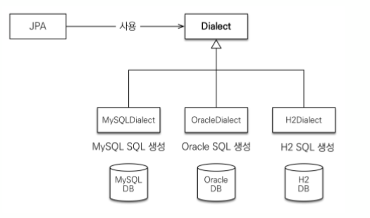

# 2장 JPA 시작

## 하이버네이트를 사용하기 위한 핵심 라이브러리

* hibernate-core : 하이버네이트 라이브러리
* hibernate-entitymanage : 하이버네이트가 JPA 구현체로 동작하도록 JPA 표준을 구현한 라이브러리
* hibernate-jpa-2.1-api : JPA 2.1 표준 API를 모아둔 라이브러리

## 예제

### 객체 매핑 시작 

```sql
// 데이터 베이스 테이블 생성 
CREATE TABLE MEMBER (
    ID VARCHAR(255) NOT NULL,
    NAME VARCHAR(255),
    AGE INTEGER,
    PRIMARY KEY (ID)
)
```

```java
// 회원 클래스 , 맵핑 어노테이션 추가 
package japbook.start;

import javax.persistence.*;

@Entity // 이 클래스를 테이블과 매핑한다고 JPA 에게 알려준다.
@Table(name = "MEMBER") // 엔티티 클래스에 매핑할 테이블 정보를 알려준다
public class Member {

    @Id // 엔티티 클래스의 필드를 테이블의 기본 키에 매핑한다, 식별자 필드라 한다.
    @Column(name = "ID")
    private String id;
    
    @Column(name = "NAME") // 필드를 컬럼에 매핑한다.
    private String username;
    
    // 매핑 정보가 필요없는 필드, 필드명을 사용해서 컬럼명으로 매핑 
    private Integer age;
    
    public String getId() {return id;}
    public void setId(String id) {this.id = id;}
    
    public String getUsername() {return username;}
    public void setUsername(String username) {this.username = username;}
    
    public Integer getAge() {return age;}
    public void setAge(Integer age) {this.age = age;}
}
```

### persistence.xml 설정

이 설정 파일은 META-INF/persistence.xml 클래스 패스 경로에 있으면 별도의 설정없이 JPA 가 인식한다.

```markup
<?xml version="1.0" encoding="UTF-8"?>
<!-- xml 네임스페이스와 사용할 버젼 명시 -->
<persistence xmlns="http://xmlns.jcp.org/xml/ns/persistence" version="2.1">

    <!-- 영속성 유닛 설정, 연결할 테이터베이스당 하나의 영속성 유닛 등 -->
    <persistence-unit name="jpabook">

        <properties>
            <!-- 필수 속성 -->
            
            <!-- JPA 표준 속성 -->
            <!-- JDBC 드라이브 -->
            <property name="javax.persistence.jdbc.driver" value="org.h2.Driver"/>
            
            <!-- 데이터베이스 접속 아이 -->
            <property name="javax.persistence.jdbc.user" value="sa"/>
            
            <!-- 데이터 베이스 접속 비밀번호 -->
            <property name="javax.persistence.jdbc.password" value=""/>
            
            <!-- 데이터베이스 접속 URL -->
            <property name="javax.persistence.jdbc.url" value="jdbc:h2:tcp://localhost/~/test"/>
            
            <!-- 하이버네이트 속 -->
            <!-- 데이터베이스 방언 설정 -->
            <property name="hibernate.dialect" value="org.hibernate.dialect.H2Dialect" />

            <!-- 옵션 -->
            <property name="hibernate.show_sql" value="true" />
            <property name="hibernate.format_sql" value="true" />
            <property name="hibernate.use_sql_comments" value="true" />
            <property name="hibernate.id.new_generator_mappings" value="true" />

            <!--<property name="hibernate.hbm2ddl.auto" value="create" />-->
        </properties>
    </persistence-unit>

</persistence>
```

### 데이터베이스 방언

* JPA 는 특정 데이터 베이스에 종속적이지 않은 기술이다.
  * 따라서 다른 데이터 베이스로 손쉽게 교체할 수 있다
* 데이터 베이스마다 다음과 같은 차이점이 있음
  * 데이터 타입
    * MYSQL =&gt; VARCHAR
    * ORACLE =&gt; VARCHAR2
  * 다른 함수명
    * MYSQL =&gt; SUBSTRING\(\)
    * ORACLE =&gt; SUBSTR\(\)
  * 페이징 처리
    * MYSQL =&gt; LIMIT
    * ORACLE =&gt; ROWNUM
* SQL 표준을 지키지 않거나 특정 데이터베이스만의 고유한 기능을 JPA 에서 _**방언**_ 이라고 한다.



* 하이버네이트가 제공하는 방언들
  * H2
  * 오라클 10g
  * MySQL

### 애플리케이션 개발 

```java
package jpabook.start;

import javax.persistence.*;
import java.util.List;

public class JpaMain {

    public static void main(String[] args) {

        //[엔티티 매니저 팩토리] - 생성
        EntityManagerFactory emf = 
            Persistence.createEntityManagerFactory("jpabook");
        
        //[엔티티 매니저] - 생성
        EntityManager em = emf.createEntityManager();

        //[트랜잭션] - 획득
        EntityTransaction tx = em.getTransaction();

        try {
            tx.begin(); //[트랜잭션] - 시작
            logic(em);  //비즈니스 로직 실행
            tx.commit();//[트랜잭션] - 커밋
        } catch (Exception e) {
            e.printStackTrace();
            tx.rollback(); //[트랜잭션] - 롤백
        } finally {
            em.close(); //[엔티티 매니저] - 종료
        }

        emf.close(); //[엔티티 매니저 팩토리] - 종료
    }

    public static void logic(EntityManager em) {

        String id = "id1";
        Member member = new Member();
        member.setId(id);
        member.setUsername("지한");
        member.setAge(2);

        //등록
        em.persist(member);

        //수정
        member.setAge(20);

        //한 건 조회
        Member findMember = em.find(Member.class, id);
        System.out.println("findMember=" + findMember.getUsername() + ", age=" + findMember.getAge());

        //목록 조회
        List<Member> members = em.createQuery("select m from Member m", Member.class).getResultList();
        System.out.println("members.size=" + members.size());

        //삭제
        em.remove(member);

    }
}
```

### 엔티티 매니저 설정


#### 엔티티 매니저 팩토리 생성 

1. persistence.xml 의 설정 정보를 사용해서 엔티티 매니저 팩토리를 생성
2. Persistence 클래스는 티티 매니저 팩토리를 생성해서 JPA 를 사용할 수 있게 준비
3. 이름이 jpabook 인 영속성 유닛 을 찾아서 엔티티 매니저 팩토리를 생성
4. **티티 매니저 팩토리는 애플리케이션 전체에서 딱 한번만 생성하고 공유해서 사용해아 한다.**

\*\*\*\*

#### **엔티티 매니저 생성**

1. JPA 의 기능 대부분은 엔티티 매니저가 제공
2. 엔티티 매니저를 사용해서 엔티티를 데이터베이스에 등록/수정/삭제/조회 할 수 있음
3. 엔티티 매니저는 내부에 데이터소스\(데이터베이스 커넥션\)을 유지하면서 데이터 베이스와 통신
4. **엔티티 매니저는 데이터베이스 커넥션과 밀접한 관계가 있으므로** _**스레드 공유,재사용 금지**_ 

#### 종료

* 사용이 끝난 엔티티 매니저는 반드시 종료해야됨
* 애플리케이션을 종료할 때 엔티티 매니저 팩토리도 종료해야됨

### 트랜잭션 관리

* 트랜잭션 API 를 사용해서 비지니스 로직이 정상 동작이면 트랜잭션 커밋
* 예외가 발생하면 트랜잭션을 롤백 

### 비지니스 로직 

* 비지니스 로직을 보면 등록, 수정, 삭제, 조회 작업이 엔티티 매니저\(em\) 을 통해서 수행
* 엔티티 매니저는 객체를 저장하는 가상의 데이터베이스 처럼 보인다.

#### 등록

* 엔티티를 저장하려면 엔티티 매니저의 persist\(\) 메소드에 저장할 엔티티를 넘겨준다.
* `em.persist(member);`
* `INSERT INTO MEMBER(ID, NAME, AGE) VALUES ('id1', '지한', 2)`

#### 수정

* JPA 는 어떤 엔티티가 변경되었는 지 추적하는 기능을 갖추고 있다
* 따라서 `member.setAge(20)` 처럼 엔티티 값을 변경하면 UPDATE SLQ 을 생성해서 데이터 베이스 값을 변경한다.
* `em.update()` 라는 메소드는 없다.

#### 삭제

* 엔티티 매니저의 `remove()` 메소드에 삭제하려는 엔티티를 넘겨준다.

#### 한 건 조회

* `find()` 메소드는 조회할 엔티티 타입과 @Id 로 데이터베이스 테이블의 기본키와 매핑한 식별자 값으로 엔티티 하나를 조회하는 가장 단순한 조회 메소드 이다.

### JPQL

```java
//하나 이상의 회원 목록을 조
List<Member> members 
    = em.createQuery("select m from Member m", Member.class).getResultList();
System.out.println("members.size=" + members.size());
```

* 테이블이 아닌 엔티티 객체를 대상으로 검색하려면 데이터베이스의 모든 데이터를 애플리케이션에 불러와서 엔티티 객체로 변경한 다음 검색해야 하는데 &gt;&gt;&gt; 이건 불가능
* 애플리케이션이 필요한 데이터만 데이터베이스에서 불러오려면 결국 조건이 포함된 SQL 을 사용해야됨
* JPA 는 JPQL\(Java Persistence Query Language\) 라는 쿼리 언어로 이런 문제를 해결 
* JPQL 은 SQL 문법과 거의 유사함 
  * 차이점
  * SQL
    * 데이터 베이스 테이블 대상으로 쿼리
  * JPQL
    * 엔티티 객체를 대상으로 쿼리, 클래스와 필드를 대상으로 쿼리 
* `select m from Member m` 여기서 Member 는 회원 엔티티 객체임 
* **JPQL 은 데이터베이스 테이블을 전혀 알지 못한다.**

\*\*\*\*

\_\_

