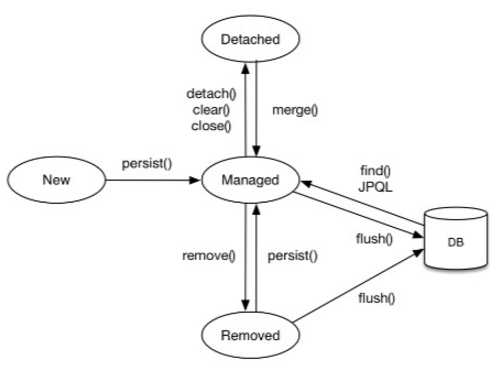
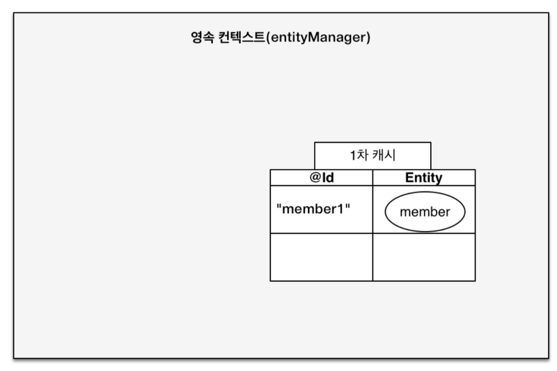
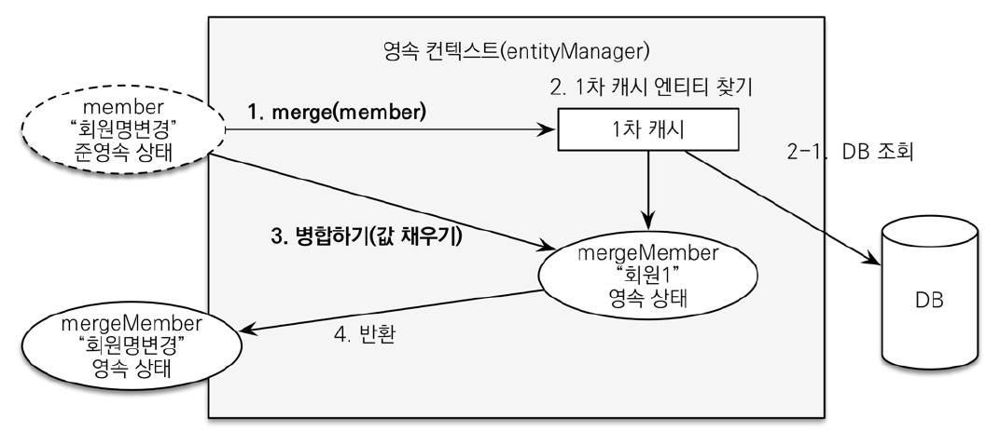

# 3장 영속성 관리

이 장에서는 매핑한 엔티티를 엔티티 매니저를 통해 어떻게 사용하는지 알아보자 

개발자 입장에서 엔티티 매니저는 엔티티를 저장하는 가상의 데이터베이스로 생각하면 된다.

## 엔티티 매니저 팩토리와 엔티티 매니저 


* 엔티티 매니저 팩토리를 만드는 비용은 상당히 크다.
* 따라서 한 개만 만들어서 애플리케이션 전체에서 공유하도록 설계 
* 반면에 공장에서 엔티티 매니저를 생성하는 비용은 거의 들지 않는다.



* 엔티티 매니저 팩토리는 여러 스레드가 동시에 접근해도 안전
* 엔티티 매니저는 여러 스레드가 동시에 접근하면 동시성 문제 발생


## 영속성 컨텍스트란?

#### Persistence Context = 엔티티를 영구 저장하는 환경

* 엔티티 매니저로 엔티티를 저장하거나 조회하면 엔티티 매니저는 영속성 컨텍스트에 엔티티를 보관,관리한다.
* 영속성 컨텍스트는 엔티티 매니저를 생성할 때 하나 만들어진다.


여러 엔티티매니저가 같은 영속성 컨텍스트에 접근 가능 \(자세한 건 11장에서...\)


## 엔티티의 생명주기 



#### 엔티티의 4가지 상태

1. 비영속\(new/transient\) : 영속성 컨텍스트와 전혀 관계가 없는 상태
2. 영속\(managed\) : 영속성 컨텍스트에 저장된 상태
3. 준영속\(detached\) : 영속성 컨텍스트에 저장되었다가 분리된 상태
4. 삭제\(removed\) : 삭제된 상태 

### 비영속 

* 엔티티 객체를 생성함
* 순수한 객체 상태이며 아직 저장하지 않았다
* 영속성 컨텍스트나 데이터베이스와는 전혀 관련이 없다.

```java
// 객체만 생성한 상태
Member meber = new Member();
member.setId("member1");
member.setUsername("회원1");
```

### 영속

* 엔티티 매니저를 통해서 엔티티를 영속성 컨텍스트에 저장했다. 
* 영속성 컨텍스트가 관리하는 상태이므로 영속 상태

```java
// 객체를 저장한 상태
em.persist(member);
```

### 준영속

* 영속성 컨텍스트가 관리하던 영속 상태의 엔티티를 영속성 컨텍스트가 관리 하지 않으면 준영속
* 준영속 상태로 만들려면 `em.detach()` 를 호출
* 아니면 `em.close()` 를 호출해서 영속성 컨텍스트를 닫거나
* `em.clear()` 을 호출해서 영속성 컨텍스트를 초기화 시켜도 준영속이 된다. 

### 삭제

* 엔티티를 영속성 컨텍스트와 데이터베이스에서 삭제

```java
// 객체를 삭제한 상태
em.remove(member);
```

## 영속성 컨텍스트의 특징

### 영속성 컨텍스트와 식별자 값

* 영속성 컨텍스트는 엔티티를 식별자 값\(@Id 로 테이블의 기본 키와 매핑한 값\) 으로 구분
* **영속 상태는 식별자 값이 반드시 있어야 한다.** 

### **영속성 컨텍스트와 데이터베이스 저장**

* 영속성 컨텍스트에 엔티티를 저장하면 이 엔티티는 언제 데이터베이스에 저장될까?
* JPA 는 보통 트랜잭션을 커밋하는 순간 영속성 컨텍스트에 새로 저장된 엔티티를 데이터 베이스에 반영 &gt;&gt; Flush\(플러시\) 라고 한다.

### 영속성 컨텍스트가 엔티티를 관리하면 나오는 장점

1. 1차 캐시
2. 동일성 보장
3. 트랜잭션을 지원하는 쓰기 지연
4. 변경 감지
5. 지연 로딩 

## 영속성 컨텍스트를 사용하는 이유

### 엔티티 조회

* 영속성 컨텍스트는 내부에 캐시를 가지고 있음 \( 1차 캐시 라고함 \)
* 영속성 컨텍스트 내부에 `Map` 이 하나 있는 데 키는 `@Id` 로 매핑한 식별자이고 값은 엔티티 인스턴스 



* 영속성 컨텍스트에 데이터를 저장하고 조회하는 모든 기준은 데이터베이스 기본 키 값이다.

#### 1차 캐시에서 조회


```java
// 1차 캐시에서 조회 
Member findMember = em.find(Member.class, "member1");
```

#### 데이터베이스에서 조회

* em.find\(\) 를 호출했는데 만약 엔티티가 1차 캐시에 없으면 엔티티 매니저는 데이터베이스를 조회해서 엔티티를 생성한다. 
* 그리고 1차 캐시에 저장한 뒤 영속 상태의 엔티티를 반환한다.


* 이렇게 되면 member1, member2 가 1차 캐시에서 있어서 바로 불러올 수 있어서 성능상 이점이 있다!

### 영속 엔티티의 동일성 보장 

```java
Member a = em.find(Member.class, "member1");
Member b = em.find(Member.class, "member1");

System.out.println(a == b); // 동일성 비교
```

* `em.find(Member.class, "member1");` 을 반복해서 호출해도 영속성 컨텍스트는 1차 캐시에 있는 같은 엔티티 인스턴스를 반환한다. 
* 위 예제에서 당연히  a 와 b 는 같은 인스턴스다.
* **영속성 컨텍스트는 성능상 이점과 엔티티의 동일성을 보장**한다. 

### 엔티티 등록 

```java
EntityManager em = emf.createEntityManager();
EntityTransaction transaction = em.getTransaction();
// 엔티티 매니저는 데이터 변경 시 트랜잭션을 시작해야 한다
transaction.begin(); // [트랜잭션] 시작

em.persist(memberA);
em.persist(memberB); 
// 영속 상태이며, DB INSERT SQL을 보내지 않음

transaction.commit(); // [트랜잭션] 커밋
```

* 엔티티 매니저는 트랙잭션을 커밋하기 직전까지 내부 쿼리 저장소에 INSERT SQL 을 차곡차곡 모아둔다.
* 트랜잭션을 커밋할 때 모아둔 쿼리를 데이터베이스에 보내는 데
* 이것을 트랜잭션을 지원하는 **쓰기 지연\(transactional write-behind\)** 라고 한다. 


* commit\(\) 을 하면 엔티티 매니저는 우선 영속성 컨텍스트를 flush 한다. 
* flush 는 영속성 컨텍스트의 변경 내용을 데이터베이스에 동기화 하는 작업 
* 지연 SQL 저장소에 모인 쿼리를 데이터베이스에 보낸다
* 동기화 한 후에 실제 데이터베이스 트랜잭션을 커밋한다. 

### 엔티티 수정 

#### SQL 수정 쿼리의 문제점 

* SQL 을 사용하면 수정 쿼리를 직접 작성해야 된다. 
* 요구 사항이 많아지면 수정 쿼리도 점점 추가 된다. 
* 이러한 개발 방식은 수정 쿼리가 많아지는 것은 물론이고
* 비지니스 로직을 분석하기 위해 SQL 을 계속 확인해야 된다.
* 결국 SQL 에 의존적으로 되버린다. 

#### JPA 의 변경 감지

```java
EntityManager em = emf.createEntityManager();
EntityTransaction transaction = em.getTransaction();
transaction.begin() // [트랜잭션] 시작

// 영속 엔티티 조회
Member memberA = em.find(Member.class, "memberA");

// 영속 엔티티 데이터 수정
memberA.setUsername("hi");
memberA.setAge(10);

// em.update(member); update 함수가 있어야 될 거 같지만 사실 없어도 된다. 

transaction.commit(); // [트랜잭션] 커밋
```

* JPA 를 쓰면 그냥 영속 엔티티 데이터를 수정하기만 하면 된다. 
* 엔티티의 변경 사항을 데이터베이스에 자동으로 반영하는 기능을 Dirty Checking \(변경 감지\) 라 한다.


* 엔티티를 영속성 컨텍스트에 보관할 때, 최초 상태를 복사해서 저장해두는 걸 **스냅샷** 이라고 한다.
* 플러시 시점에서 스냅샷과 엔티티를 비교해서 변경된 엔티리를 찾는다. 
* 변경 감지는 **영속성 컨텍스트가 관리하는 영속 상태의 엔티티에만 적용** 
* 비영속, 준영속인 엔티티는 값을 변경해도 반영되지 않음 

위 그림에서 UPDATE SQL 이 어떤 모습으로 생성 될 까?

```sql
// 예상
UPDATE MEMBER
SET
    NAME = ?,
    AGE = ?
WHERE
    ID = ?
------------------------
// 실제 
UPDATE MEMBER
SET
    NAME = ?,
    AGE = ?,
    GRADE = ?,
    ...
WHERE
    ID = ?
```

* 변경된 값만 UPDATE 에 들어갈 거라고 상상했지만
* 사실은 엔티티의 모든 필드를 업데이트 한다. 
* 이렇게 되면 데이터 베이스에 보내는 데이터 전송량이 증가하는 단점이 있지만
* 다음과 같은 장점이 있다.

1. 모든 필드를 사용하면 수정쿼리가 항상 같다. 따라서 애플리케이션 로딩 시점에 수정 쿼리를 미리 생성해두고 재사용 할 수 있다.
2. 테이터 베이스에 동일한 쿼리를 보내면 데이터 베이스는 이전에 한번 파싱된 쿼리를 재사용 할 수 있다.


참고로 컬럼이 대략 30개 이상되면 기본 방법으로 하는 거보다 @DynamicUpdate 를 사용한 동적 쿼리가 빠르다고 한다. \( 동적 쿼리는 수정된 데이터만 update 할 수 있게 한다.\)

본인 환경에서 테스트 해서 적합한 방법을 선택하면 된다.


### 엔티티 삭제 

```java
Member memberA = em.find(Member.class, "memberA"); // 삭제 대상 탐색
em.remove(memberA); // 엔티티 삭제 
```

* 엔티티를 즉시 삭제하는 것이 아니라 엔티티 등록과 비슷하게 삭제쿼리를 지연 SQL 저장소에 등록
* 트랜잭션을 커밋해서 플러시를 호출하면 실제 데이터베이스에 삭제쿼리를 전달.
* 참고로 em.remove 를 호출한 순간 memberA 는 영속성 컨텍스트에서 제거 된다. 

## 플러시 

**플러시는 영속성 컨텍스트의 변경 내용을 데이터베이스에 반영한다.** 

영속성 컨텍스트를 플러시하는 방법은 3가지가 있다.

1. em.flush\(\) 를 직접 호출한다.
2. 트랜잭션 커밋 시 플러시가 자동 호출
3. JPQL 쿼리 실행 시 플러시가 자동 호출

#### 직접 호출

flush\(\) 를 직접 호출해서 영속성 컨텍스트를 강제로 플러시한다.  
테스트나 다른 프레임워크와 JPA를 함께 사용할 때를 제외하고 거의 사용하지 않는다.

#### 트랜잭션 커밋 시 플러시 자동 호출 

트랜잭션을 커밋하기 전에 꼭 플러시를 호출해서 영속성 컨텍스트의 변경 내용을 데이터베이스에 반영한다.  
JPA 는 트랜잭션만 커밋하면 데이터가 데이터베이스에 반영안되는 문제를 예방하기 위해서 트랜잭션을 커밋할 때 자동으로 플러시를 호출한다.

#### JPQL 쿼리 실행 시 플러시 자동 호출

```java
em.persist(memberA);
em.persist(memberB);
em.persist(memberC);

//중간에 JPQL 실행
query = em.createQuery("select m from Member m", Member.class);
List<member> members = query.getResultList();
```

memberA, memberB, memberC 를 영속 상태로 만들었다. 하지만 아직 데이터베이스에 반영이 되지 않았는데 이때 JPQL 을 실행하면 어떻게 될까? 

아직 memberA,B,C 는 데이터베이스에 없으므로 쿼리 결과로 조회되지 않는다.

따라서 쿼리를 실행하기 직전에 영속성 컨텍스트를 플러시해서 해당 내용을 반영해 준다. 

JPA가 JPQL 을 실행할 때도 플러시를 자동 호출해줘서 MemberA,B,C 도 쿼리 결과에 포함 된다.


참고로 식별자 기준으로 조회하는 find\(\) 메소드를 호출 할때는 플러시 실행이 되지 않는다.



### 플러시 모드 옵션 

* javax.persistence.FlushModeType 을 사용하면 된다.
* FlushModeType.AUTO : 커밋이나 쿼리를 실행할 때 플러시 \(기본값\)
* FlushModeType.COMMIT : 커밋할 때만 플러시 
* `em.setFlushMode(FlushModeType.COMMIT)` : 플러시 모드 직접 설정 

## 준영속 

영속 -&gt; 준영속의 상태 변화를 알아보자

**준영속이란? 영속성 컨텍스트가 관리하는 영속 상태의 엔티티가 영속성 컨텍스트에서 분리된 것**

준영속 상태의 엔티티는 **영속성 컨텍스트가 제공하는 기능을 사용할 수 없다.** 

#### **준영속 상태로 만드는 방법** 

1. em.detach\(entity\) : 특정 엔티티만 준영속 상태로 전환한다.
2. em.clear\(\) : 영속성 컨텍스트를 완전히 초기화 한다.
3. em.close\(\) : 영속성 컨텍스트를 종료한다. 

### 엔티티를 준영속 상태로 전환 : detach\(\)

```java
... 
 
em.persist(member); // 영속 상태

em. detach(member); // 준영속 상태 

...
```

* 영속 상태였다가 더는 영속성 컨텍스트가 관리하지 않는 준영속 상태가 되버렸다.
* 이러면 1차 캐시에서도 삭제, 관련 쓰지 지연 SQL 저장소에서도 삭제가 되버린다. 
* 준영속 상태는 영속성 컨텍스트로부터 분리\(detatched\) 된 상태다. 

### 영속성 컨텍스트를 초기화: clear\(\)

em.clear\(\) 는 영속성 컨텍스트를 초기화해서 해당 영속성 컨텍스트의 모든 엔티티를 준영속으로 만든다.

```java
Member member = em.find(Member.class, "memberA"); // 영속성 상태 

em.clear(); // 영속성 컨텍스트 초기화 

member.sestUserName("changeName"); // 준영속 상태 
```

* 영속성 컨텍스트에 있는 모든 값을 초기화 해버린다. 
* 영속성 컨텍스트를 제거하고 새로 만든 것과 같다. 
* memberA 뿐만아니라 memberB도 있었다면 memberB 로 없어진다. 

### 영속성 컨텍스트 종료: close\(\)

* 영속성 컨텍스트를 종료하면 해당 영속성 컨텍스트가 관리하던 영속 상태의 엔티티가 모두 준영속이 된다.

```java
...
transaction.begin(); // 트랜잭션 시작

Member memberA = em.find(Member.class, "memberA"); // 영속성 상태 
Member memberB = em.find(Member.class, "memberB"); // 영속성 상태 

transaction.commit(); // 트랜잭션 커밋

em.close(); // 영속성 컨텍스트 닫기(종료)
```

* 영속성 컨텍스트가 아예 종료되어 버려서 memberA, B 는 관리되지 않는다. 


영속 상태의 엔티티는 주로 영속성 컨텍스트가 종료되면서 준영속 상태가 된다. 개발자가 직접 준영속 상태로 만드는 일은 드물다. 


### 준영속 상태의 특징 

#### 거의 비영속 상태에 가깝다. 

* 1차 캐시, 쓰기 지연, 변경 감지, 지연 로딩을 포함한 영속성 컨텍스트가 제공하는 어떠한 기능도 동작하지 않는다.

#### 식별자값을 가지고 있다.

* 비영속 상태는 식별 값이 없을수도 있지만 준영속 상태는 이미 한 번 영속 상태였으므로 반드시 식별자 값을 가지고 있다.

#### 지연 로딩을 할 수 없다.

* 지연 로딩은 실제 객체 대신 프록시 객체를 로딩해두고 해당 객체를 실제 사용할 때 영속성 컨텍스트를 통해 데이터를 불러오는 방법이다. 자세한 내용은 8장에서 ....

### 병합 : merge\(\)

준영속 상태의 엔티티를 다시 영속 상태로 변경하려면 병합을 사용하면 된다. 

merge\(\) 메소드는 **준영속 상태의 엔티티를 받아서 새로운 영속 상태의 엔티티를 반환**한다. 

```text
Member mergeMember = em.merge(member);
```



1. merge 를 실행한다.
2. 파라미터로 넘어온 준영속 엔티티의 식별자 값으로 1차 캐시에서 엔티티를 조회한다.
   1. 1차 캐시에 엔티티가 없으면 데이터베이스에서 엔티티를 조회해서 1차 캐시를 채워준다.
3. 조회한 영속 엔티티\(mergeMember\) 에 member 엔티티의 값을 채워 넣는다.
4. mergeMember 을 반환한다. 

파라미터로 넘어온 준영속 엔티티는 병합 후에도 준영속 상태로 남아 있다. 

`파라미터로 넘어온 준영속 엔티티 != mergeMember 엔티티`

따라서 `member = em.merge(member);` 하면 준영속 엔티티를 반환된 영속 엔티티를 참조하도록 하는 편이 좋다. 

### 비영속 병합 

* 병합은 준영속, 비영속을 신경쓰지 않는다.
* 식별자 값으로 엔티티를 조회할 수 있으면 불러서 병합하고 조회할 수 없으면 새로 생성해서 병합한다.
* 병합은 save or update 기능을 수행

## 정리

1. 엔티티 매니저는 엔티티 매니저 팩토리에서 생성 
2. 영속성 컨텍스트는 애플리케이션과 데이터베이스 사이에서 객체를 보관하는 가상의 데이터베이스 역할 
3. 영속성 컨텍스트에 저장한 에티티는 플러시 시점에 데이터베이스에 반영 일반적으로 트랜잭션을 커밋할 때 영속성 컨텍스트가 플러시
4. 영속성 컨텍스트가 해당 엔티티를 더 이상 관리하지 못하면 준영속 상태 

